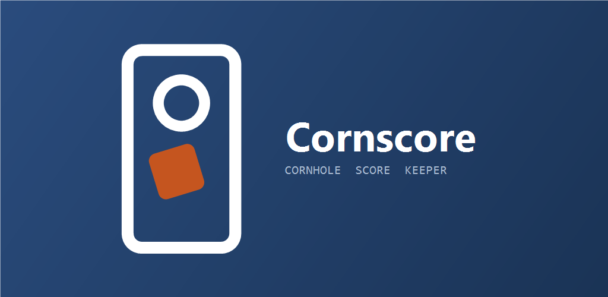

  

# ScoreToss

Compteur de points pour les jeux d'extérieur, à commencer par le **cornhole**.

Conçu pour être lu d'un coup d'œil depuis l'autre planche, et utilisé debout dans un jardin : deux
grands chiffres, chacun dans la couleur de son équipe, et rien d'autre qui réclame l'attention
pendant la partie. Aucune publicité, aucun compte, aucun serveur — l'application fonctionne
intégralement hors ligne.

## Essayer

| | |
| --- | --- |
| **Web** | <https://lilkuririn.github.io/Cornscore/> — *Ajouter à l'écran d'accueil* l'installe en plein écran, et elle fonctionne ensuite sans réseau |
| **Android** | [`cornscore.apk`](https://github.com/LilKuririn/Cornscore/releases/download/apk/cornscore.apk) — installation directe, reconstruite à chaque modification |
| **Play Store** | en test fermé — voir [le carnet de publication](store/publication.md) |

En local, ouvrir [`index.html`](index.html) dans un navigateur suffit.

---

## Compter une partie

**Simple (1v1) ou double (2v2).** Nom d'équipe, noms des joueurs, couleur au choix parmi neuf.
Passer d'un mode à l'autre repart de noms vides, un joueur n'étant pas une équipe.

**Saisie par manche.** Un compteur *trou* (3 points) et un compteur *planche* (1 point) par équipe,
plafonnés à quatre sacs. L'annulation est calculée et affichée avant validation : personne n'a de
soustraction à faire entre deux lancers.

**Suivi de l'honneur.** L'équipe qui a marqué lance en premier à la manche suivante. La toute
première est désignée par un tirage au sort, présenté comme un rouleau de machine à sous.

**Feuille de match.** Historique manche par manche avec score courant. Chaque manche peut être
corrigée ou supprimée après coup, aussi loin soit-elle : l'historique est rejoué et le score
recalculé sur toute la partie. Une erreur de décompte se répare en cinq secondes au lieu de finir
en discussion.

**Fin de partie.** Vainqueur, score final, puis la courbe des points cumulés des deux équipes,
manche après manche, graduée en points, le score à atteindre marqué en pointillés. Dessous, le face-à-face colonne
contre colonne — points, manches gagnées, sacs dans le trou, sacs sur la planche, meilleure
manche : la meilleure valeur de chaque ligne prend la couleur de son équipe, l'autre s'efface.
Revanche en un appui, ou partage du résultat en texte.

## Tournois

De **2 à 16 équipes**, en élimination directe. Quand le nombre d'équipes n'est pas une puissance de
deux, les premières du tableau sont exemptées du premier tour — le placement suit l'ordre classique
où la tête de série rencontre la dernière équipe.

L'arbre reste consultable en permanence : les vainqueurs apparaissent dans leur couleur avec le
score final, le prochain match est mis en avant et rappelé dans la barre du bas. À la fin d'un
match, on enchaîne sur le suivant ou on revient au tableau.

Le tournoi et la partie en cours sont sauvegardés séparément : un 1v1 improvisé ne fait pas perdre
le tableau commencé. Et rien n'oblige à aller au bout — on peut repartir d'un nouveau tableau ou
abandonner, en deux appuis pour éviter la fausse manœuvre.

## Palmarès

Les parties terminées sont archivées, tournoi compris, pour répondre à la seule question qui fâche
entre deux barbecues : **qui mène**.

- **Confrontations** — le face-à-face de chaque paire, avec une barre partagée dans leurs couleurs
- **Classement** — victoires, défaites, ratio
- **Dernières parties** — date, vainqueur, score

Une petite marque `1v1` ou `2v2` distingue les joueurs des équipes. Un nom apparu dans les deux
formats n'en reçoit aucune : elle mentirait.

## Les règles appliquées

Un sac dans le trou vaut **3 points**, un sac sur la planche **1 point**. Chaque équipe lance
**4 sacs** par manche — en double, 2 sacs par joueur. Seule la **différence** entre les deux équipes
est marquée : 5 points contre 3 rapportent 2 points, l'autre équipe n'en marque aucun. La partie
s'arrête dès qu'une équipe atteint le score visé.

Le **score à atteindre** — 11, 15 ou 21, 21 par défaut — est le seul réglage, visible sur l'accueil.
Le rappel des règles est une fiche qui s'ouvre par-dessus l'écran, et se referme d'un toucher.

## Vos données restent chez vous

Aucune donnée ne quitte le téléphone. Pas de compte, pas de serveur, pas de traceur, pas de
publicité. Les parties, les tournois et le palmarès sont enregistrés localement et disparaissent
avec l'application.

Une **sauvegarde** exportable en JSON permet de tout emporter avant de changer de téléphone, et de
le restaurer ensuite.

## Langues

Français, anglais et espagnol. La langue suit celle du téléphone au premier lancement et se change
depuis la fiche *À propos*, où une position « Téléphone » permet de revenir au suivi automatique.

Le vocabulaire suit celui de la fédération : *frame* en anglais désigne la manche, *round* le tour
de tournoi — deux mots que le français confond.

## Comment c'est fait

HTML, CSS et JavaScript natifs dans **un seul fichier**, sans dépendance ni étape de compilation.
Le thème est défini par des variables CSS et les couleurs d'équipe sont dérivées du fond avec
`color-mix()`, ce qui rend l'interface lisible en clair comme en sombre sans dupliquer une seule
règle. L'état est conservé dans `localStorage`.

L'APK n'est pas une copie de l'application : `android/` est une coquille native minimale — une
WebView qui sert `index.html` depuis ses assets — et la compilation va chercher les fichiers web à
la racine du dépôt. Il n'existe donc qu'une seule version du code.

Deux choix méritent d'être signalés côté Android. Les assets sont servis par une origine `https`
interne plutôt qu'en `file://`, sans quoi `localStorage` n'est pas fiable selon les versions. Et le
bouton retour du téléphone s'appuie sur l'interface existante : il ferme la feuille de match ou
remonte d'un écran avant de proposer de quitter, sans qu'`index.html` ait eu à bouger.

Le build tourne dans GitHub Actions, aucune chaîne d'outils Android n'est nécessaire en local. Le
site est publié par GitHub Pages depuis `main` : un `git push` suffit à déployer les deux.

## Dans le dépôt

| Chemin | Rôle |
| --- | --- |
| `index.html` | Toute l'application |
| `sw.js`, `manifest.webmanifest` | Installation sur l'écran d'accueil et fonctionnement hors ligne |
| `icon-*.png`, `apple-touch-icon.png` | Icônes 192 / 512 / masquable |
| `privacy.html` | Politique de confidentialité, trilingue |
| `android/` | Coquille native et projet Gradle |
| `.github/workflows/apk.yml` | Construction de l'APK et du bundle |
| `store/` | Visuels, textes de fiche et [carnet de publication](store/publication.md) |

## Ce qui viendra

Le mölkky, la pétanque et le palet, sous forme de modules au-dessus du même moteur — l'accueil liste
déjà les jeux et garde une place pour eux. Les tournois en poules, quand l'élimination directe
montrera ses limites.
